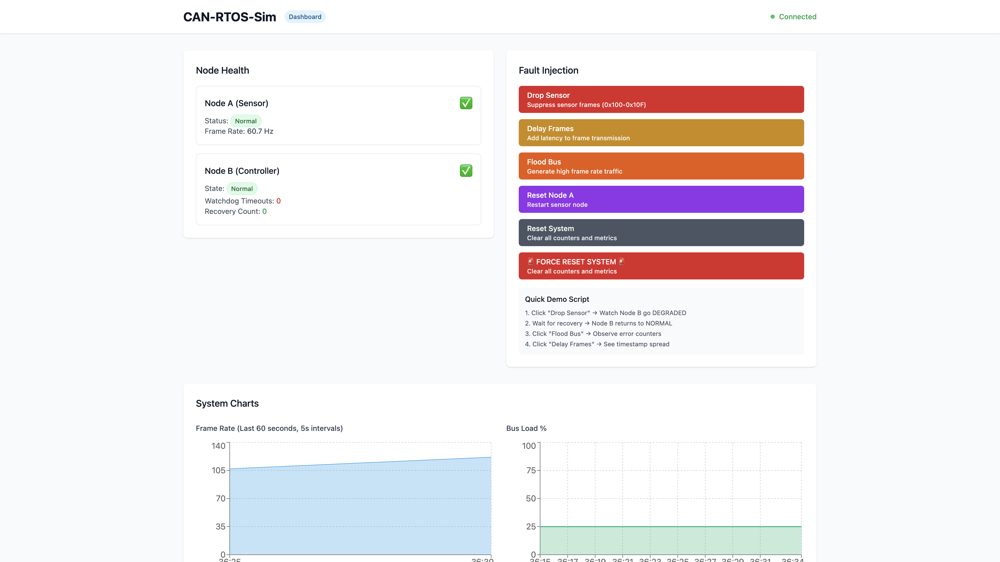
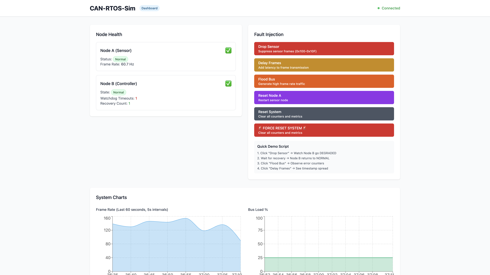
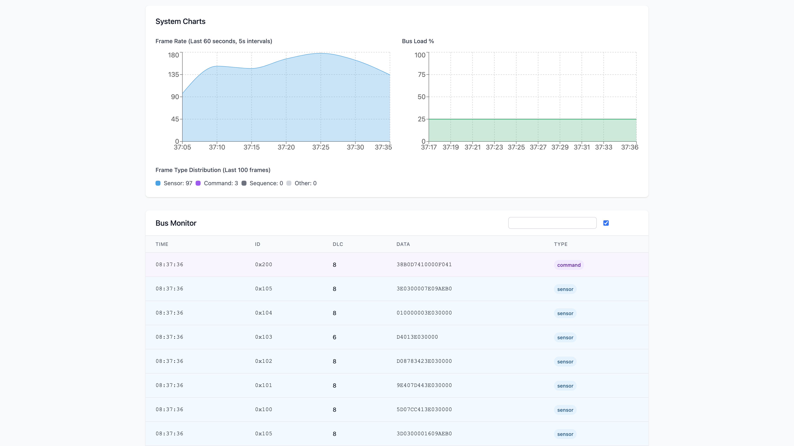
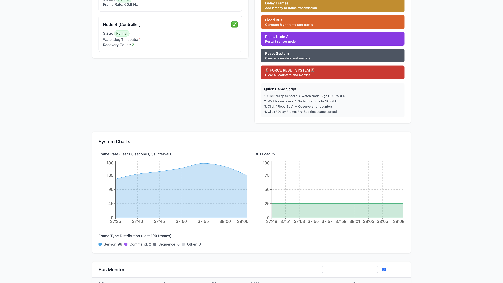

# CAN-RTOS-Sim

[](https://github.com/chaffybird56/CAN-RTOS-Sim/actions/workflows/ci.yml)

**What you get:** A browser dashboard that watches two embedded-style CAN nodes talk over a virtual bus — live frame traffic, node health, charts, and buttons to break things on purpose (drop frames, delay, flood, reset) so you can see watchdogs and recovery in action.

> Two RTOS-like C++ nodes (sensor + controller), a FastAPI backend, and a Next.js HIL panel — no physical CAN hardware required (Docker + simulated bus).

<p align="center">
  
  <br/>
  <sub>Live HIL dashboard: node health, fault-injection controls, frame-rate charts, and bus monitor.</sub>
</p>

| Normal operation | Fault injection |
|---|---|
| Sensor and controller nodes report <strong>Normal</strong> while frames flow at ~100+ Hz. | Click <strong>Drop Sensor</strong> or <strong>Flood Bus</strong> to stress the network and watch counters move. |
|  |  |

## At a glance

| | |
|---|---|
| **Problem** | Automotive ECUs share a CAN bus; failures (dropped frames, floods, resets) must be detected and recovered. |
| **Approach** | Sensor node TX + controller watchdog/state machine, with a web panel for monitoring and scripted fault injection. |
| **Dashboard** | Node health, real-time charts, hex bus monitor, one-click fault scenarios. |
| **Stack** | C++ nodes · FastAPI + WebSocket · Next.js · Docker Compose |

## Screenshots

### Bus monitor — live CAN frames

Every frame shows timestamp, ID, DLC, hex payload, and type (sensor / command / sequence). Filter by ID range or toggle hex vs decimal.

<p align="center">
  
</p>

### Fault injection — flood the bus

Inject high-rate traffic and watch frame-rate charts spike while the monitor fills with mixed frame types.

<p align="center">
  
</p>

## Why it matters

This project simulates real-world embedded automotive systems where multiple ECUs communicate over CAN buses. It demonstrates:

- **Fault tolerance** — how systems handle communication failures  
- **Watchdog mechanisms** — automatic recovery from degraded states  
- **Live monitoring** — real-time visibility into bus traffic and node health  
- **Fault injection** — controlled testing of system resilience  

## Features

- **Virtual CAN bus** — no physical hardware needed (Docker)  
- **Two simulated nodes** — sensor (periodic TX) and controller (watchdog + state machine)  
- **Fault injection** — drop, delay, flood, and reset  
- **Live dashboard** — frame monitor, node health, charts  
- **Cross-platform** — runs on Mac via Docker's Linux VM  

## Stack

- **Nodes:** C++17 cooperative loops, SocketCAN-oriented design  
- **Backend:** FastAPI, WebSocket streaming  
- **Frontend:** Next.js, Tailwind, Recharts  
- **Orchestration:** Docker Compose  

## Quickstart

### One command (recommended)

```bash
./quickstart.sh
```

Builds images, starts services, checks health, opens http://localhost:3000.

### Manual

```bash
docker compose -f ops/compose.yml build
docker compose -f ops/compose.yml up -d
open http://localhost:3000
```

### Make shortcuts

```bash
make -C ops build
make -C ops up
```

## How it works

```
┌─────────────┐    vcan0     ┌─────────────┐
│   Node A    │◄─────────────►│   Node B    │
│ (Sensor)    │               │(Controller) │
└─────────────┘               └─────────────┘
       │                             │
       └─────────────┐       ┌───────┘
                     ▼       ▼
              ┌─────────────────────┐
              │    FastAPI Server   │
              │  (CAN monitor +     │
              │   fault injection)  │
              └─────────────────────┘
                       │
                       ▼
              ┌─────────────────────┐
              │   Next.js Dashboard   │
              └─────────────────────┘
```

## Fault injection scenarios

| Fault | What it does | What to watch |
|-------|----------------|---------------|
| **Drop Sensor** | Suppress sensor frames (0x100–0x10F) | Controller watchdog, degraded state |
| **Delay Frames** | Add latency | Timestamp spread in bus monitor |
| **Flood Bus** | High frame-rate traffic | Charts spike, mixed frame types |
| **Reset Node A** | Restart sensor path | Brief gap then recovery |

## Demo script

The dashboard includes a built-in **Quick Demo Script** (Fault Injection panel). For a guided recording:

```bash
./scripts/demo_recording.sh
```

## Troubleshooting

**Docker not running**

```bash
docker info
```

**Services not up**

```bash
docker compose -f ops/compose.yml ps
docker compose -f ops/compose.yml logs
```

**Dashboard empty**

```bash
curl http://localhost:8000/health
curl http://localhost:8000/frames?limit=5
```

**Validation**

```bash
./scripts/validate_can.sh
python3 test_system.py
```

## Repository layout

```
CAN-RTOS-Sim/
├─ node_a/              # Sensor ECU (C++)
├─ node_b/              # Controller ECU (C++)
├─ server/              # FastAPI backend
├─ panel/               # Next.js dashboard
├─ bus/                 # vcan0 setup container
├─ ops/compose.yml      # Docker orchestration
├─ media/screenshots/   # README visuals
└─ scripts/             # validate, demo recording
```

## Roadmap

- [ ] Renode/Zephyr integration for more realistic RTOS simulation  
- [ ] SQLite logging for historical analysis  
- [ ] Prometheus + Grafana dashboards  
- [ ] Multi-bus topologies (CAN-FD, LIN)  

## License

MIT — see [LICENSE](LICENSE).
